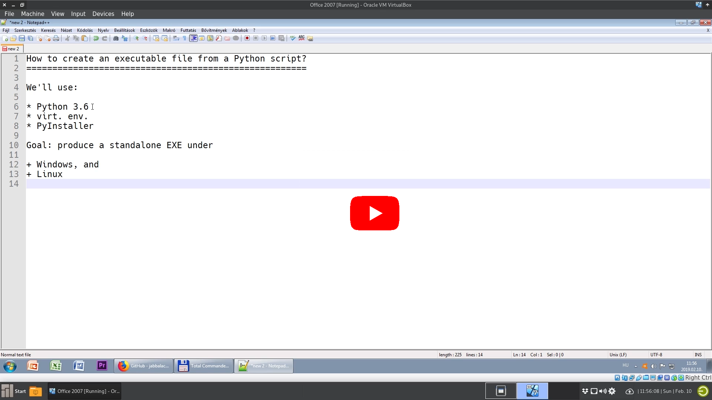

Python EXE Maker
================

This little project shows you how to build an executable file
of your Python code.

Here, `hello.py` is the main file. It uses a module (`helper.py`),
it imports the `os` module from the stdlib, and it even uses
a 3rd-party library (`requests`).

With PyInstaller, you can easily create a single executable file from
this project.

    $ pyinstaller --onefile hello.py

Under Windows you might have a problem with this. If the `.exe` complains that
a DLL is missing, then try this variation:

    $ pyinstaller --onefile --noupx hello.py

You'll find the exe in the `dist/` folder.

Why would you need an EXE?
--------------------------

EXE is a file extension for an executable file format. It makes distributing your
program much easier. The exe produced by PyInstaller is standalone.
It means that it's enough to give this exe to your friend and (s)he can run it right away.
There is no need to install Python on his/her machine, no need to create a virtual environment, etc.
Under Windows you can simply start an exe with a double click.

Of course, if your friend uses Windows (Linux), then create the exe under
Windows (Linux).

Will my EXE run faster?
-----------------------

**No.** PyInstaller simply creates a bundle that contains everything: your code,
the necessary modules / packages, the virtual environment, the Python interpreter, etc.
When you launch the EXE, it is extracted to your temp folder (under Linux
it's the `/tmp` folder), and your application is started from there. So the
runtime will be approximately the same.

For a demo, check out my simple Fibonacci implementation in the folder `speed_test`.

Making an EXE
-------------

The project uses the uv package manager. Create
and activate the virtual environment. Then, with

    $ make exe

and with

    $ make exe2

you can create an executable.

Video
-----

Click on the image below to open a YouTube video that shows you everything step-by-step:

  

Changes since the video was made:

* The project was updated to Python 3.13.
* In the video I talk about pipenv, but the project was updated to use uv.

Links / News / Related Work
---------------------------

* This project of mine got included in [PyCoder's Weekly -- Issue #355](https://pycoders.com/issues/355)
under the title "PythonEXE: How to Create an Executable File From a Python Script?"
* Reddit discussion: [here](https://old.reddit.com/r/learnpython/comments/aoxoki/i_made_a_sample_project_to_demonstrate_how_to/).
* [Using PyInstaller to Easily Distribute Python Applications](https://realpython.com/pyinstaller-python/),
a blog post on the same topic
* [PyUpdater](https://github.com/JMSwag/PyUpdater), a pyinstaller auto-update framework
